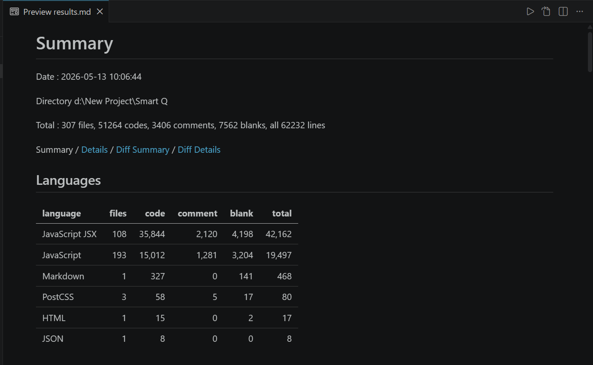

# Smart Q – Hospital Queue Management System

Note: This is a portfolio showcase version of the project.

For security and intellectual property reasons, the full production source code and privileged modules are shared privately with recruiters, reviewers, and evaluators upon request.

# FOR COMPLETE SOURCE CODE ACCESS

## Please Contact Me Directly

Please connect with me through LinkedIn or email for complete access to the production-level implementation.

- LinkedIn: [Thanoj Kumar](https://www.linkedin.com/in/thanojkumarpantangi/)
- Email: [thanojpantangi@gmail.com](mailto:thanojpantangi@gmail.com)

**Prepared by Thanoj**

Smart Q is a modern, production-ready hospital queue management system that digitizes patient flow, reduces waiting times, improves operational efficiency, and strengthens healthcare security for clinics and multi-department hospitals.

---

## Problem Statement

Hospitals and clinics often rely on manual token systems and disconnected workflows, causing:

* unpredictable waiting times
* overcrowding in waiting areas
* poor emergency/senior prioritization
* weak doctor–patient coordination
* lack of real-time visibility
* poor login/session security for sensitive medical systems

---

## Solution Overview

Smart Q digitizes queue management using department-based token generation, real-time doctor workflows, priority-aware ordering, secure authentication, and advanced security controls.

Queue priority is enforced as:

`EMERGENCY > SENIOR > NORMAL`

with real-time updates using Socket.IO.

The platform also includes trusted device verification, session control, two-step verification, suspicious login detection, and geofencing-based access protection for Admin and Doctor roles.

---

## Project File Structure



---

## Key Features

### Queue & Consultation Management

* Department-specific token generation
* Priority-aware queue ordering
* Doctor workflows: call / skip / complete
* Real-time live queue updates via Socket.IO
* Department queue display endpoints for TV/waiting areas
* Patient visit history and consultation records
* QR-based patient verification

### Patient Experience Features

* Music system for active patients with today's waiting token
* Voice announcement when patient token is near consultation
* Reduced physical crowding and better waiting experience
* Real-time queue visibility for patients

### Security Features

* JWT authentication
* Trusted devices management
* Session management (single session logout / logout all)
* Two-step MFA
* Risk-based login detection
* Security alerts for suspicious activity
* Password recovery with secure reset flow
* OTP phone verification

### Advanced Protection

* Geofencing for Doctor and Admin access
* IP location tracking using IPInfo API
* Device verification for high-risk logins
* Login approval flow for unknown devices

### Admin & Analytics

* Department and doctor management
* Doctor verification and leave handling
* Admin dashboard KPIs
* Queue analytics and workload reports
* Department load and throughput tracking
* Live queue monitoring

---

## Live URLs

* **Frontend:** [https://hospitalqueuemanagement.vercel.app](https://hospitalqueuemanagement.vercel.app)
* **Backend:** [https://hospitalqueuemanagement.onrender.com](https://hospitalqueuemanagement.onrender.com)

---

## Tech Stack

### Frontend

* React (Vite)
* React Router DOM
* Tailwind CSS
* Socket.IO Client
* Recharts
* Framer Motion
* QR Scanner

### Backend

* Node.js
* Express.js
* MongoDB (Mongoose)
* JWT Authentication
* Socket.IO
* bcrypt
* Redis Rate Limiting
* node-cron
* Brevo Email Service
* IPInfo API

---

## Core API Modules

### Authentication

* Login / Signup
* Refresh token flow
* Logout
* MFA verification
* Trusted device verification
* Security login approval

### Queue Management

* Generate token
* Call next patient
* Skip / Complete token
* Token history
* Queue summary

### Patient & Visits

* Patient profile
* Visit history
* QR verification
* Active token tracking

### Sessions & Security

* Active sessions listing
* Logout specific session
* Logout all sessions
* Trusted device handling
* Suspicious login protection

### Analytics

* Daily patient count
* Department load
* Doctor workload
* Waiting time analytics
* Throughput and utilization
* Live queue analytics

---

## Architecture Summary

### Frontend

React-based dashboard and patient portal handling:

* authentication
* queue interaction
* doctor workflows
* real-time updates
* analytics dashboards
* security verification flows

### Backend

Express server handling:

* authentication
* queue prioritization
* token lifecycle
* visits and consultations
* sessions and trusted devices
* geofencing checks
* suspicious login detection
* analytics generation

### Database

MongoDB stores:

* Users
* Departments
* Tokens
* Visits
* Sessions
* Trusted Devices
* Messages
* Security Logs

---

## Security Highlights

### Trusted Device Flow

New login attempts from unknown devices trigger verification before access is granted.

### Risk-Based Login Detection

High-risk logins are detected using:

* device mismatch
* IP changes
* unusual location access
* geofencing violations

### Security Alerts

Users receive alerts for:

* suspicious logins
* new device access
* password reset requests
* critical account actions

---

## Environment Variables Example

```env
PORT=5000
MONGODB_URI=your_mongodb_uri
JWT_SECRET=your_secret
JWT_ACCESS_SECRET=your_access_secret
JWT_REFRESH_SECRET=your_refresh_secret
CLIENT_URL=your_frontend_url
FRONTEND_URL=your_frontend_url
NODE_ENV=development
BREVO_API_KEY=your_brevo_api_key
MAIL_FROM=you@example.com
MAIL_FROM_NAME=SmartQ
IPINFO_API_KEY=your_ipinfo_api_key
PATIENT_QR_SECRET=your_qr_secret
ACCESS_TOKEN_EXPIRES=15m
REFRESH_TOKEN_EXPIRES=30d
ENABLE_INTERNAL_CRON=true
```

---

## Screenshots Preview

### Admin Dashboard

* Queue analytics
* Department management
* Doctor workload monitoring
* Live queue supervision

### Doctor Dashboard

* Call next patient
* Skip / Complete consultation
* Visit history management
* Telemedicine consultation controls

### Patient Dashboard

* Token status tracking
* Today's active queue updates
* Music system during waiting
* Voice announcements for near-turn alerts

### Security Verification Screen

* Trusted device verification
* Suspicious login approval flow
* Risk-based login protection

---

## Demo Credentials

### Patient Access (Public Demo)

Email: [patient@demo.com](mailto:patient@demo.com)
Password: Demo@123

This allows reviewers to test the patient flow directly.

### Doctor / Admin Access (Protected Demo)

Doctor and Admin accounts include advanced security features:

* Two-Step MFA
* Trusted Device Verification
* Risk-Based Login Detection
* Security Alerts
* Session Management
* Geofencing Protection

For security reasons, Doctor and Admin credentials are not publicly shared.

To access the full secure demo environment for evaluation, please contact me via:

- LinkedIn: [Thanoj Kumar](https://www.linkedin.com/in/thanojkumarpantangi/)
- Email: [thanojpantangi@gmail.com](mailto:thanojpantangi@gmail.com)

I will provide guided access for recruiters, reviewers, and evaluators.

> Demo access is provided securely to protect privileged accounts and production-style security flows.

---

## Local Setup

### Clone Repository

```bash
git clone <repository-url>
cd hospital-queue-management
```

### Frontend Setup

```bash
cd Frontend
npm install
npm run dev
```

### Backend Setup

```bash
cd BackEnd
npm install
npm run dev
```

### Environment Setup

Create `.env` files for both frontend and backend using the environment variables listed below.

---

## Folder Structure

```text
Hospital Queue Management/
│
├── Frontend/
│   ├── src/
│   ├── components/
│   ├── pages/
│   └── services/
│
├── BackEnd/
│   ├── controllers/
│   ├── routes/
│   ├── models/
│   ├── middleware/
│   ├── sockets/
│   └── utils/
│
└── README.md
```

---

## What Makes Smart Q Different

Unlike traditional hospital token systems, Smart Q combines queue intelligence with production-grade security.

Unique differentiators include:

* trusted device verification
* risk-based login detection
* two-step MFA
* geofencing protection
* telemedicine online consultation
* live queue updates using tokens + WebSockets
* voice announcements for nearby tokens
* waiting-area music system for active patients
* suspicious login approval flow
* IP location tracking using IPInfo API

---

## Telemedicine & Real-Time Consultation

Smart Q supports remote consultation for patients who cannot physically visit the hospital.

Features include:

* telemedicine online consultation flow
* doctor-controlled remote consultation sessions
* live patient queue synchronization
* WebSocket-based instant queue updates
* token-based real-time patient status updates
* smooth transition from waiting → called → consultation → completed

This ensures both local and remote patients can be managed in a single unified queue system.

---

## Challenges Solved

### Queue Challenges

* preventing queue starvation
* maintaining fair priority ordering
* handling concurrent doctor token actions
* department-wise queue balancing

### Security Challenges

* trusted device approval without hurting UX
* suspicious login detection without false blocking
* secure session revocation
* high-risk login verification flow

### Real-Time Challenges

* live token synchronization across devices
* doctor dashboard consistency
* telemedicine consultation session flow
* instant patient status updates using WebSockets

---

## Future Improvements

* AI-based waiting time prediction
* multilingual voice announcements
* advanced doctor scheduling optimization
* automated emergency case prioritization
* smart appointment pre-booking
* hospital branch multi-location support
* deeper telemedicine workflow expansion

---

## License

MIT License

This project is created for educational, portfolio, and production-scale system design purposes.

---

## Project Goal

Smart Q is built to create a safer, faster, and more intelligent hospital experience where queue management, patient flow, and account security work together seamlessly in one production-ready platform.